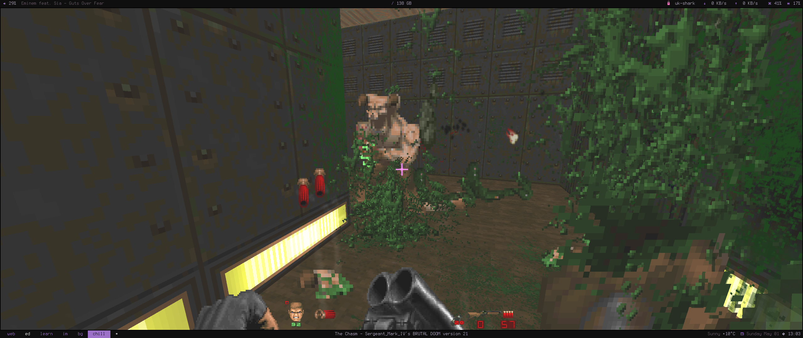

# [brutal doom](https://youtu.be/oSzYliSASKc)



## Install

1. `direnv allow`
2. copy [your wads](https://zdoom.org/wiki/Category:Supported_games) to wad/

```
wad
├── doom.wad
├── doom2.wad
├── plutonia.wad
└── tnt.wad
```

## Run 

`gzdoom brutalv21.pk3 -iwad wad/doom2.wad` or `./doom2.sh` 

## Deps

* [brutal doom](https://www.moddb.com/mods/brutal-doom) by [sgtmarkiv](https://www.patreon.com/sgtmarkiv)
* [gzdoom](https://github.com/coelckers/gzdoom)

