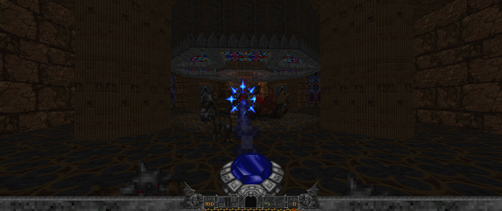

# [brutal doom](https://youtu.be/oSzYliSASKc)




## Install

1. `direnv allow`
2. copy [your wads](https://zdoom.org/wiki/Category:Supported_games) to wad/

```
wad
├── doom.wad
├── doom2.wad
├── heretic.wad
├── hexdd.wad
├── hexen.wad
├── plutonia.wad
└── tnt.wad
```

## Run 

You need to select a wad for `gzdoom` and optionally a mod

* brutal doom: `gzdoom brutalv21.pk3 -iwad wad/doom2.wad` or `./doom2.sh` 
* cronos unleashed: `gzdoom cronos-unleashed.pk3 -iwad wad/hexen.wad`
* vanilla wad: `gzdoom -iwad wad/heretic.wad`

`gzdoom` without options can detect all your wads automatically:

```
Please select a game wad (or 0 to exit):
1. DOOM 2: Hell on Earth (doom2)
2. Final Doom: Plutonia Experiment (plutonia)
3. Final Doom: TNT - Evilution (tnt)
4. The Ultimate DOOM (doom)
5. Heretic: Shadow of the Serpent Riders (heretic)
6. Hexen: Beyond Heretic (hexen)
7. Hexen: Deathkings of the Dark Citadel (hexdd)
```

## Deps

* [brutal doom](https://www.moddb.com/mods/brutal-doom) by [sgtmarkiv](https://www.patreon.com/sgtmarkiv)
* [cronos unleashed](https://www.moddb.com/mods/cronos-unleashed) by [perfectionismtech](https://github.com/perfectionismtech)
* [gzdoom](https://github.com/coelckers/gzdoom)

